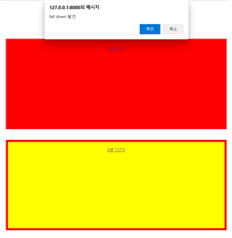

# [디바이스마트2022] 고령층 care를 위한 낙상 모니터링 시스템 - SmartCCTV

Role: Back-end Dev, Django, Front-end Dev, MySQL
공모전: 디바이스마트 2022 ICT 공모전 제출
소요시간: 2022.02 ~ 2022.03
팀원 수: 4

# 1. 작품주제

고령층 care를 위한 낙상 모니터링 시스템

---

# 2. 기능

### 라즈베리파이를 통한 프레임 전송

CCTV 역할을 하는 라즈베리 파이를 통해 찍힌 영상을 프레임단위로 서버에 소켓통신을 통해 전송.

### CCTV 메인 페이지

맨 처음에 화면에 들어온 경우 회원 가입을 하고 회원가입이 이루어지면 CCTV 보러 가기 기능으로 넘어 갈 수 있는 **index 페이지**이다.

### CCTV 보러가기

현재는 2개의 CCTV만을 사용하는 것으로 설정하였으나 모듈화와 객체지향적 설계로 필요시 CCTV 증가 및 CCTV 페이지 증가는 금방 가능하다.

### Fall down 감지시 발생

해당 페이지를 통해서 만약 CCTV가 설치된 공간에서 f**all down이 감지가 되면 ajax를 통해서 실시간으로 알림을 할 수 있도록 한다.**

### 실시간 스트리밍 확인

CCTV 페이지로 넘어가게 되면 현재 해당 CCTV가 설치된 공간의 상황에 대해서 확인할 수 있다.

---

# 3. 사용기술

### 소켓통신

- 소켓통신을 이용해 라즈베리파이의 파이카메라에서 찍힌 이미지 영상 프레임이 실시간으로 웹서버로 전송한다.
- 스레드 기술을 사용해 여러대의 클라이언트(라즈베리파이)와의 소켓 통신 연결이 가능해 동시에 복수개의 상황을 감지할 수 있다.

### 웹 서비스

-  웹프레임워크 장고를 이용해 웹서버를 구현함.
-  Ajax를 통해 낙상이 감지되면 사용자는 실시간으로 알림을 받아볼 수 있다.
-  사용자는 동시에 복수개의 라즈베리파이를 연결해 쓰러짐 모니터링 서비스를 받아볼 수 있다.

### YOLO 알고리즘

-YOLO(You Only Look Once) v3는 본 프로젝트에서 사용자의 행동을 정의하기

위한 사람 **데이터를 실시간으로 수집**하는 데 핵심적인 역할을 할 알고리즘이다.

-yolo는 기존의 Object Detection 모델과 다르게 이미지 전체를 한번만 본다.

이는 class에 대한 맥락적 이해가 다른 모델에 비해 높아 낮은 False-Positive를

보인다.

-yolo의 큰 특징은 **실시간으로 객체를 탐지할 수 있다는 것**이다 Yolo는 **높은**

**성능은 아닐 지라도 준수한 성능으로 실시간 Object Detection을 가능하게**

**해준다.**

### AlphaPose 알고리즘

-Alphapose 알고리즘은 사람 객체에서 머리를 포함해 주요 관절 키포인트를
감지하고 좌표를 반환할 수 있는 알고리즘이다. 키포인트를 연결한 집합(스켈레
톤)으로 좀 더 정확한 자세가 예측 가능하다.
- Pose Estimaition에 있어서 유명한 알고리즘으로는 Alpha Pose와 OpenPose
가 존재하지만 AlphaPose의 벤치마킹 성능이 더욱 우수하다.

### ST-GCN 알고리즘

-ST-GCN 알고리즘은 어떤 그래프 구조를 이미지 convolution과 유사한 방식으
로 연산해서 특징점을 추출하는 네트워크이다.

-ST-GCN은 다음 그림과 같이 Alphapose에서 구한 스켈레톤 기반의 행동 예측
알고리즘에서 구한 skeleton data를 그래프 형태로 만들고 각각의 노드가 이어
지는 부분(시간, 공간)을 edge로 연결 ST-GCN 모듈을 통해 feature를 추출한
후 마지막으로 softmax함수를 통해 행동을 분류한다.

---

# 4. 역할

- 장고 프레임워크를 이용한 웹서버 개발
- html, css, js, 부트스트랩을 이용한 프론트엔드 부분 개발
- 라즈베리파이와 서버 간 소켓통신 개발
- fall down 감지 알고리즘 등 인공지능 알고리즘 서버에 적용